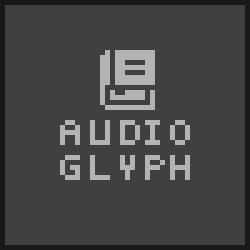

# AudioGlyph
</img>  

Simple Audiobook GUI made with C and raylib/raygui.  
Currently only supported in Linux.

## Vision
Today there aren't any free and open source GUIs for managing audiobooks (i.g. Calibre for Ebooks).
Audioglyph aims to solve that problem.

❗❗**If you want to contribute to this repository I strongly suggest that you fork it and build a better repo that can be better supported and maintained as I'm getting busy with other things and won't be able to maintain this project as something more serious than a side project.**

## Thoughts for the Future
Refactor the project and make it a web app that will run locally instead of a desktop GUi application.

## Tools & Libraries Used
- Raylib: https://github.com/raysan5/raylib
- Raygui: https://github.com/raysan5/raygui
- TinyFD: https://sourceforge.net/projects/tinyfiledialogs/
